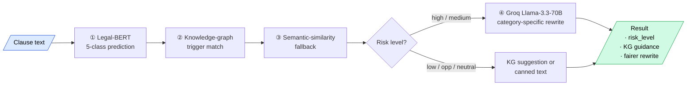

<div align="center">

# 🏗️ ZimKAG

### Supervised NLP for Risk &amp; Opportunity Detection in Bespoke Construction Contracts

**Development of a Supervised NLP Model to Assist in Identification of Risks and Opportunities in Bespoke Construction Contracts in Zimbabwe**

[](https://www.python.org/)
[](https://fastapi.tiangolo.com/)
[](https://pytorch.org/)
[](https://huggingface.co/transformers/)
[](#-licence)

*A Master of Quantity Surveying research project · University of Zimbabwe*

</div>

---

## 🎯 What is ZimKAG?

**ZimKAG** is an end-to-end NLP system that helps quantity surveyors and contract administrators in Zimbabwe **read construction contracts faster and safer**. A contractor uploads a PDF / DOCX / TXT contract (JCT, NEC4, FIDIC or bespoke) and ZimKAG returns a clause-by-clause classification into:

| Class | Meaning |
|---|---|
| 🚨 **High Risk** | Significantly favours the Employer; potential red flag |
| 🟠 **Medium Risk** | Some imbalance; worth tightening in negotiation |
| 🟡 **Low Risk** | Standard balanced provision |
| ✅ **Opportunity** | Favours the Contractor — defend during negotiation |
| ⚪ **Neutral** | Heading, definition or pure boilerplate |

Each risky clause is paired with **knowledge-graph guidance** (Zimbabwe-specific: RBZ, RTGS/ZiG, ZIMRA, EMA, NSSA, OHSACT, Arbitration Act 7:15) and an **LLM-generated fairer rewrite**.

---

## ✨ Highlights

- **10 000-clause labelled dataset** spanning JCT, NEC4, FIDIC and bespoke Zimbabwean contracts
- **Fine-tuned Legal-BERT** (`nlpaueb/legal-bert-base-uncased`) for 5-class clause classification
- **Hybrid pipeline** — Legal-BERT prediction → Knowledge-graph trigger matching → Semantic-similarity fallback → LLM rewrite
- **Modern web app** — FastAPI backend with async job pipeline, single-page UI (Tailwind CDN + vanilla JS + Chart.js), dark mode, drag-drop, branded PDF report download
- **Zimbabwe-aware knowledge graph** with 8 risk categories and fuzzy trigger matching
- **Graceful degradation** — runs in KG-only mode if the model is missing, with canned suggestions if no LLM key

---

## 🖼️ Screenshots

> Open the app at <http://127.0.0.1:18000> after running `zimkag_webapp/run.bat`.

| Hero + upload | Live progress | Per-clause analysis |
|:---:|:---:|:---:|
| Drop a PDF, paste text, or try a sample clause | Animated progress bar polling the async job | Risk pill, confidence bar, KG guidance and LLM rewrite |

---

## 🗂️ Repository structure

```
.
├── ZIMKAG.ipynb                          # Clean training + evaluation notebook (Colab)
├── construction_contracts_dataset.csv    # 10 000 labelled clauses (the deliverable dataset)
├── Schema Image.jpeg                     # Original training-data schema reference
│
├── generate_dataset.py                   # Builds the 10 k dataset from clause libraries
├── update_notebook.py                    # Historical: first pass at notebook update
├── cleanup_notebook.py                   # Rebuilds the notebook into 22 clean cells
│
└── zimkag_webapp/                        # Production web application
    ├── backend/
    │   ├── app.py                        # FastAPI routes, async job runner
    │   ├── inference.py                  # Legal-BERT + KG + semantic engine
    │   ├── extraction.py                 # PDF / DOCX / TXT → clauses
    │   ├── llm.py                        # Groq client + prompt templates
    │   ├── reports.py                    # Branded PDF report generator
    │   └── config.py                     # .env-driven settings
    ├── frontend/
    │   ├── index.html                    # Single-page UI (Tailwind CDN)
    │   ├── style.css
    │   └── app.js                        # Vanilla JS · Chart.js
    ├── models/                           # ← drop trained model here (gitignored)
    ├── .env.example                      # Configuration template
    ├── requirements.txt                  # Pinned Python dependencies
    ├── run.bat / run.sh                  # One-command launchers
    └── README.md                         # Web-app-specific documentation
```

---

## 📊 The Dataset

`construction_contracts_dataset.csv` contains **10 000 labelled clauses** with the following schema:

| column          | type    | values                                                      |
|-----------------|---------|-------------------------------------------------------------|
| `text`          | string  | Raw clause text                                             |
| `risk_level`    | enum    | `high · medium · low · opportunity · neutral`               |
| `clause_type`   | enum    | payment, delay, indemnity, variation, termination, dispute, force_majeure, warranty, administrative, regulatory, site_conditions |
| `one_sided`     | bool    | `true` / `false`                                            |
| `jurisdiction`  | string  | `UK` / `ZW` / `PH`                                          |
| `contract_type` | string  | `JCT` / `NEC4` / `FIDIC` / `bespoke`                        |
| `notes`         | string  | Annotator rationale                                         |

**Distribution**

| Risk level   | Count | %     |  | Contract type | Count | %     |
|--------------|------:|------:|---|---------------|------:|------:|
| high         | 2 435 | 24.4 |  | bespoke (ZW)  | 3 659 | 36.6 |
| low          | 2 269 | 22.7 |  | JCT (UK)      | 2 914 | 29.1 |
| medium       | 2 181 | 21.8 |  | NEC4 (UK)     | 2 163 | 21.6 |
| neutral      | 1 995 | 19.9 |  | FIDIC (ZW/PH) | 1 264 | 12.6 |
| opportunity  | 1 120 | 11.2 |  |               |       |       |

The dataset includes **505 real clauses** extracted from five live Zimbabwean construction contracts (Zimplats Masimba Phase 2A, RAM Solutions, Pitch Carpenters, Elegance Ivy, Casecnan Multipurpose Irrigation) plus carefully curated clauses from JCT SBC/Q, NEC4 ECC, FIDIC Red Book 2017, and bespoke Zimbabwean templates — generated through `generate_dataset.py` from clause libraries authored in collaboration with practising quantity surveyors.

---

## 🚀 Quick start

### 1 · Train the model (Google Colab)

```text
1. Open ZIMKAG.ipynb in Google Colab
2. Cell 2 → upload construction_contracts_dataset.csv
3. Run all cells top-to-bottom (≈15 min on a T4 GPU)
4. Cell 9 saves the model to /content/drive/MyDrive/ZimKAG_Model/zimkag_legalbert_5class/
```

### 2 · Set up the web app locally

```bash
# Clone the repo
git clone https://github.com/<your-user>/ZimKAG.git
cd ZimKAG/zimkag_webapp

# Drop your trained model folder here:
#   models/zimkag_legalbert_5class/  ← downloaded from Google Drive
#       ├── config.json
#       ├── model.safetensors
#       ├── tokenizer.json (etc.)
#       └── label_map.json

# Configure
copy .env.example .env       # Windows
cp .env.example .env         # macOS / Linux
# Edit .env: set GROQ_API_KEY (free from https://console.groq.com/keys)

# Launch (auto-creates venv on first run)
run.bat                      # Windows
./run.sh                     # macOS / Linux

# Open http://127.0.0.1:8000  (or 18000 if 8000 is busy on your machine)
```

For full deployment / configuration / API documentation see [`zimkag_webapp/README.md`](zimkag_webapp/README.md).

---

## 🧠 How a clause is analysed

A clause flows through a **hybrid four-stage pipeline**:



> 📐 **For the full architecture — high-level diagram, sequence diagram, training pipeline, trust boundaries and design decisions — see [`docs/ARCHITECTURE.md`](docs/ARCHITECTURE.md).**

---

## 🛠 Tech stack

| Layer            | Tools                                                              |
|------------------|--------------------------------------------------------------------|
| Frontend         | HTML, Tailwind (CDN), vanilla JS, Chart.js                         |
| Backend          | FastAPI, Uvicorn, Pydantic, asyncio                                |
| Classifier       | Legal-BERT (`nlpaueb/legal-bert-base-uncased`) · 5-class fine-tune |
| Knowledge graph  | NetworkX, RapidFuzz                                                |
| Semantic search  | Sentence-Transformers (`all-MiniLM-L6-v2`)                         |
| LLM rewrites     | Groq · `llama-3.3-70b-versatile`                                   |
| Document parsing | pdfplumber, python-docx                                            |
| PDF reports      | fpdf2                                                              |
| Training         | 🤗 Transformers, Datasets, scikit-learn, matplotlib, seaborn       |

---

## 📈 Model performance

After fine-tuning Legal-BERT for 4 epochs on a stratified 70 / 15 / 15 split of the 10 000-clause dataset, the held-out test set scores are reported in the notebook (cell 6 — classification report and confusion matrix). A 5-fold cross-validation block (cell 16) is provided for thesis-grade statistics.

> Re-run the notebook to regenerate the metrics on your machine — they will vary slightly with the random seed.

---

## 🔬 Research context

This project was completed as part of:

> **Master of Quantity Surveying**
> Faculty of Engineering and the Built Environment
> *University of Zimbabwe*
>
> **Author:** Robert T. Magarire
> **Supervisors:** W. Gumindoga & T. Chihombori

**Research question** — *Can a supervised NLP model materially assist quantity surveyors in identifying risks and opportunities in bespoke construction contracts in Zimbabwe, given that bespoke contracts are commonly drafted without standard FIDIC / JCT / NEC4 templates?*

---

## 🤝 Contributing

This is an academic research project, but PRs that improve the clause libraries, expand the knowledge graph, or strengthen the model evaluation are welcome. Open an issue first to discuss substantial changes.

---

## 📜 Licence

Academic / research use only. Not for commercial redistribution without prior written consent from the author. Cite the thesis when re-using the dataset or methodology.

---

<div align="center">

Built in Zimbabwe with ☕, 🏗️ and 🤖.

</div>
