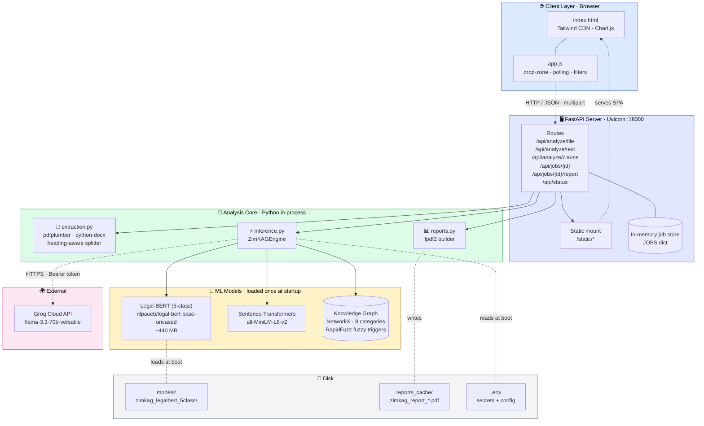
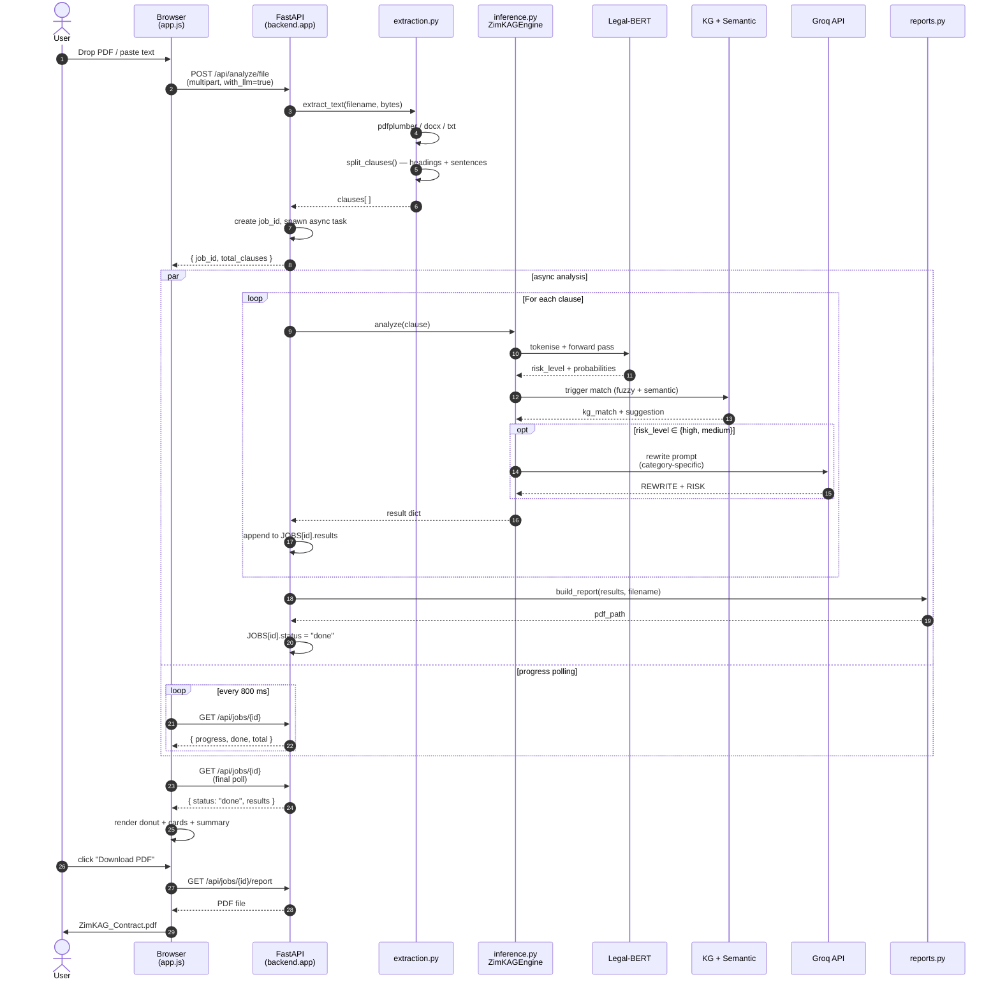
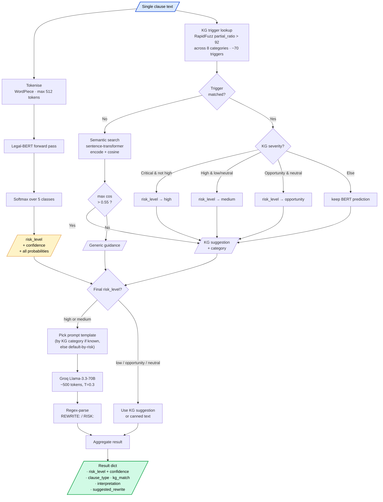
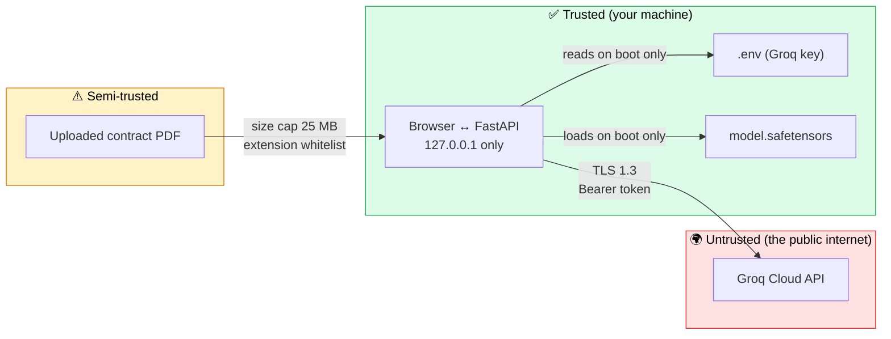

# 🏗️ ZimKAG · System Architecture

This document describes how the ZimKAG system is composed, how its components communicate, and how a contract flows through the analysis pipeline. The diagrams use [Mermaid](https://mermaid.js.org/) and render natively on GitHub. To export them as SVG/PNG for the thesis document, paste the source into <https://mermaid.live>.

> **Reading order:** start with the [high-level architecture](#1-high-level-architecture) for the big picture, then follow a single contract through the system in the [request data flow](#2-request-data-flow). The [inference pipeline](#3-inference-pipeline-zoomed-in) zooms into the most novel part — the hybrid Legal-BERT + KG + LLM analysis. The [training pipeline](#4-training-and-deployment-lifecycle) shows the end-to-end MLOps story.

---

## 1 · High-level architecture

Five logical layers cooperate over a single FastAPI process. The browser is a pure SPA (no build step); the FastAPI server is both the API and the static-file host; the analysis core is in-process; only the Groq LLM is an external dependency.



### Component responsibilities

| Component                          | Layer    | File                  | Responsibility                                                                              |
|------------------------------------|----------|-----------------------|---------------------------------------------------------------------------------------------|
| **Single-page UI**                 | Client   | `frontend/index.html` | Hero, tabs, drop-zone, progress, summary cards, donut chart, clause cards, dark mode        |
| **Client controller**              | Client   | `frontend/app.js`     | File handling, async job polling, filters/search, theming, status pill                      |
| **API routes**                     | Server   | `backend/app.py`      | `/api/analyze/*`, `/api/jobs/*`, `/api/status`, static mount, exception handler             |
| **Job store**                      | Server   | `backend/app.py`      | In-memory dict — sufficient for single-user MSc demo; swap for Redis at scale               |
| **Document extractor**             | Core     | `backend/extraction.py` | PDF/DOCX/TXT parsing → heading-aware clause segmentation                                  |
| **Inference engine**               | Core     | `backend/inference.py` | Hybrid Legal-BERT + KG + semantic + LLM analyser (the brain)                              |
| **LLM client**                     | Core     | `backend/llm.py`      | Groq HTTP wrapper + 8 category-specific prompt templates + REWRITE/RISK parser              |
| **Report builder**                 | Core     | `backend/reports.py`  | Branded PDF generator (summary, distribution chart, per-clause cards)                       |
| **Settings**                       | Core     | `backend/config.py`   | Env-driven config (port, model dir, Groq key, file-size cap)                                |
| **Legal-BERT classifier**          | ML       | `models/.../`         | 5-class clause classifier — `high · medium · low · opportunity · neutral`                  |
| **Sentence-Transformers**          | ML       | downloaded at boot    | Embedding model for semantic-similarity fallback                                            |
| **Knowledge graph**                | ML       | `backend/inference.py` | NetworkX DiGraph: 8 risk categories with Zimbabwe-aware triggers (RBZ, ZIMRA, NSSA…)      |
| **Groq Llama-3.3-70B**             | External | api.groq.com          | Generates fairer clause rewrites + one-line risk explanations                               |

---

## 2 · Request data flow

The end-to-end journey of a contract from drag-and-drop to PDF download. The pipeline is **asynchronous**: the upload returns a `job_id` immediately and the client polls `/api/jobs/{id}` for progress, so a 100-clause contract doesn't time out the HTTP request.



### Why async + polling?

| Concern                | Solution in ZimKAG                                                                  |
|------------------------|-------------------------------------------------------------------------------------|
| 100-clause contract takes ~60 s with LLM rewrites | Don't block the HTTP request; use `asyncio.create_task` and a polling job model |
| User wants live feedback | Browser polls `/api/jobs/{id}` every 800 ms, animates the progress bar              |
| LLM call can fail / time out | `groq.chat()` returns `""` on any error; engine falls back to KG suggestion          |
| Per-clause inference can fail | Each clause wrapped in try/except; failed ones get an "Error" badge but don't kill the job |

---

## 3 · Inference pipeline (zoomed in)

This is the core scientific contribution. A single clause flows through up to four stages: BERT classification, knowledge-graph escalation, semantic-similarity fallback, and (for risky clauses) an LLM rewrite. Stages 2 and 3 can override the BERT prediction when domain knowledge contradicts it.



### The 8 knowledge-graph categories

| Category                    | Severity     | Trigger examples (Zimbabwe-aware)                              |
|-----------------------------|--------------|----------------------------------------------------------------|
| `currency_risk`             | Critical     | RBZ, RTGS, ZiG, USD, hyperinflation, exchange rate             |
| `penalty_risk`              | High         | liquidated damages, 0.5% per day, uncapped, without limit      |
| `indemnity_risk`            | Critical     | indemnify, hold harmless, consequential loss                   |
| `termination_risk`          | High         | terminate at will, without cause, no claim for loss of profit  |
| `ground_conditions_risk`    | High         | unforeseeable, ground conditions, howsoever arising            |
| `payment_risk`              | High         | set-off, withhold, pay-when-paid, no advance payment           |
| `opportunity_fair`          | Opportunity  | extension of time, deemed accepted, mobilisation advance       |
| `force_majeure_protection`  | Opportunity  | force majeure, prevention event, civil unrest, pandemic        |

A **Critical** hit forces the risk level to `high` even if BERT predicted `medium`. A **High** hit only escalates `low/neutral` predictions. **Opportunity** hits upgrade `neutral` predictions to `opportunity`. This guards against false negatives on the most dangerous clauses.

### Graceful-degradation matrix

| Scenario                              | Engine behaviour                                                |
|---------------------------------------|-----------------------------------------------------------------|
| Trained model + Groq key both present | Full pipeline (the default)                                     |
| Trained model present, no Groq key    | Skip LLM step; use KG suggestion as the rewrite                 |
| No trained model, Groq key present    | KG-only classification (heuristic risk_level); LLM still rewrites |
| Neither model nor key                 | KG-only classification + canned per-category text               |

---

## 4 · Training and deployment lifecycle

How the dataset becomes a production model. Training happens once in Colab; deployment is a download-and-drop into the local web app.

```mermaid
graph LR
    subgraph DATA["📊 Dataset Construction"]
        REAL["5 real ZW contracts<br/>(505 real clauses)"]
        LIB["Curated clause libraries<br/>JCT · NEC4 · FIDIC · bespoke"]
        GEN["generate_dataset.py"]
        CSV[("construction_contracts<br/>_dataset.csv<br/>10 000 × 7 cols")]

        REAL --> GEN
        LIB --> GEN
        GEN --> CSV
    end

    subgraph TRAIN["🎓 Training · Google Colab T4"]
        UP[Upload CSV]
        SPLIT["70 / 15 / 15<br/>stratified split"]
        TOK["Tokenise<br/>nlpaueb/legal-bert-base-uncased"]
        FT["Fine-tune 4 epochs<br/>HF Trainer · weighted F1"]
        EVAL["Evaluate<br/>· held-out test<br/>· 5-fold CV<br/>· per-class P/R/F1"]
        SAVE["Save model<br/>+ label_map.json"]

        UP --> SPLIT --> TOK --> FT --> EVAL --> SAVE
    end

    subgraph DEPLOY["🚀 Deployment · Local"]
        DRIVE[(Google Drive)]
        DL["Download<br/>model folder"]
        PLACE["Drop into<br/>zimkag_webapp/models/"]
        ENV2["Configure .env<br/>(GROQ_API_KEY)"]
        RUN["run.bat / run.sh<br/>auto-creates venv"]
        APP["FastAPI app<br/>localhost:18000"]

        DRIVE --> DL --> PLACE --> ENV2 --> RUN --> APP
    end

    CSV --> UP
    SAVE --> DRIVE

    style DATA fill:#dbeafe,stroke:#2563eb,color:#000
    style TRAIN fill:#fef3c7,stroke:#d97706,color:#000
    style DEPLOY fill:#dcfce7,stroke:#16a34a,color:#000
```



### What's in the trained-model folder

```
zimkag_legalbert_5class/
├── config.json              # Model config + id2label / label2id
├── model.safetensors        # 440 MB weights (gitignored)
├── tokenizer.json           # Fast tokenizer
├── tokenizer_config.json
├── vocab.txt                # WordPiece vocabulary (BERT-base)
├── special_tokens_map.json
├── training_args.bin        # HF TrainingArguments snapshot
└── label_map.json           # Explicit {label2id, id2label} for the web app
```

`label_map.json` is the contract between the training notebook and the web app — it's what allows `inference.py` to recover the exact `risk_level` ↔ integer mapping without depending on the order of `model.config.id2label` (which HuggingFace can shuffle).

---

## 5 · API surface

| Method | Path                          | Body / params                          | Purpose                                                |
|-------:|-------------------------------|----------------------------------------|--------------------------------------------------------|
| GET    | `/`                           | —                                      | Serves `index.html`                                    |
| GET    | `/static/*`                   | —                                      | Serves frontend assets                                 |
| GET    | `/api/status`                 | —                                      | Engine + model + LLM availability                      |
| POST   | `/api/analyze/clause`         | `{clause, with_llm}`                   | Single-clause synchronous analysis                     |
| POST   | `/api/analyze/file`           | `multipart/form-data` (`file`)         | Upload contract → returns `job_id`                     |
| POST   | `/api/analyze/text`           | `{text, with_llm}`                     | Paste raw text → returns `job_id`                      |
| GET    | `/api/jobs/{id}`              | —                                      | Poll progress; returns full results when `status=done` |
| GET    | `/api/jobs/{id}/report`       | —                                      | Download branded PDF report                            |

Interactive OpenAPI docs are auto-generated at `/docs` (Swagger UI) and `/redoc`.

---

## 6 · Trust boundaries and security



| Threat                            | Mitigation                                                                       |
|-----------------------------------|----------------------------------------------------------------------------------|
| Malicious uploaded file           | 25 MB cap, extension whitelist (`.pdf .docx .txt`), `pdfplumber` runs in-process |
| Leaked Groq key                   | `.env` gitignored; key only ever in env-var, never logged                        |
| Multi-user concurrency            | Out of scope (single-user demo); `JOBS` dict has no auth — bind to `127.0.0.1`   |
| LLM prompt injection from clauses | Clauses inserted into a structured `REWRITE: / RISK:` template; output regex-parsed |
| LLM hallucination                 | Rewrites surfaced as **suggestions**; clause_type and KG match are independent   |

---

## 7 · Why this architecture?

| Decision                                | Alternative                       | Why we chose this                                              |
|-----------------------------------------|-----------------------------------|----------------------------------------------------------------|
| Hybrid BERT + KG + LLM                  | Pure BERT                         | Domain knowledge catches false negatives the model misses (currency, penalty); LLM gives actionable rewrites the model can't |
| 5-class taxonomy                        | Original 3-class                  | Distinguishes serious (high) from manageable (medium); separates true opportunity from generic boilerplate |
| Async job polling                       | Server-Sent Events / WebSockets   | Simpler, bullet-proof on Windows where SSE/WS can be flaky behind corporate proxies |
| In-memory `JOBS` dict                   | Redis / SQLite                    | Single-user MSc demo; zero ops overhead. Documented as a swap point for multi-user |
| Tailwind via CDN                        | Tailwind compiled                 | No build step → faster iteration; trade-off is offline use     |
| Groq + Llama-3.3-70B                    | OpenAI / Anthropic                | Free tier; fast inference; comparable rewrite quality on contract text |
| Local model (not Hugging Face Inference) | Hugging Face Inference Endpoints | Privacy of contracts; no per-token cost; inference fits on CPU |

---

<div align="center">

**Diagrams editable at [mermaid.live](https://mermaid.live) · Source: this file**

[← Back to README](../README.md)

</div>
